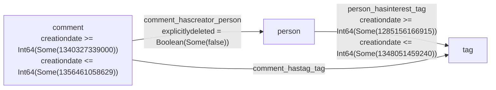

# GCard Report

## Query Graph



---
## Abstract Graph #1


### Abstract Edges Detail

### Abstract Edge E1 (src=1(comment) → dst=3(tag))

- path_vertices (len=3): `[1, 2, 3]` → ["comment", "person", "tag"]
- path_edges (len=2): `[1, 3]` → ["comment_hascreator_person", "person_hasinterest_tag"]

**src_pcf:**

```
PiecewiseConstantFunction {
  segments: 2
  [    -inf, 27078.125)  value = 320.0000,  cumulative = 8665000.0000
  [27078.125, 30497.808)  value = 216.0000,  cumulative = 9403651.5120
}

```

**dst_pcf:**

```
PiecewiseConstantFunction {
  segments: 5
  [    -inf,   14.264)  value = 102484.0000,  cumulative = 1461860.0000
  [  14.264,   36.918)  value = 57008.0000,  cumulative = 2753304.0000
  [  36.918,   89.011)  value = 44568.0000,  cumulative = 5074964.0000
  [  89.011,  158.442)  value = 32944.0000,  cumulative = 7362316.0000
  [ 158.442,  239.835)  value = 25080.0000,  cumulative = 9403651.5120
}

```

---
## Abstract Graph #2


### Abstract Edges Detail

### Abstract Edge E1 (src=1(comment) → dst=2(person))

- path_vertices (len=3): `[1, 3, 2]` → ["comment", "tag", "person"]
- path_edges (len=2): `[2, 3]` → ["comment_hastag_tag", "person_hasinterest_tag"]

**src_pcf:**

```
PiecewiseConstantFunction {
  segments: 0
}

```

**dst_pcf:**

```
PiecewiseConstantFunction {
  segments: 0
}

```

